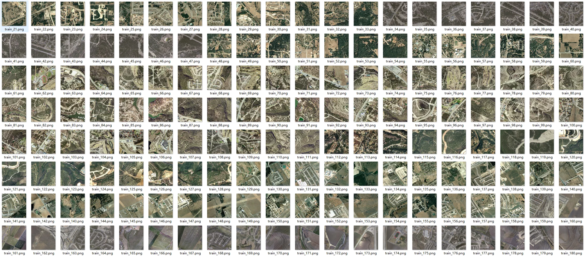
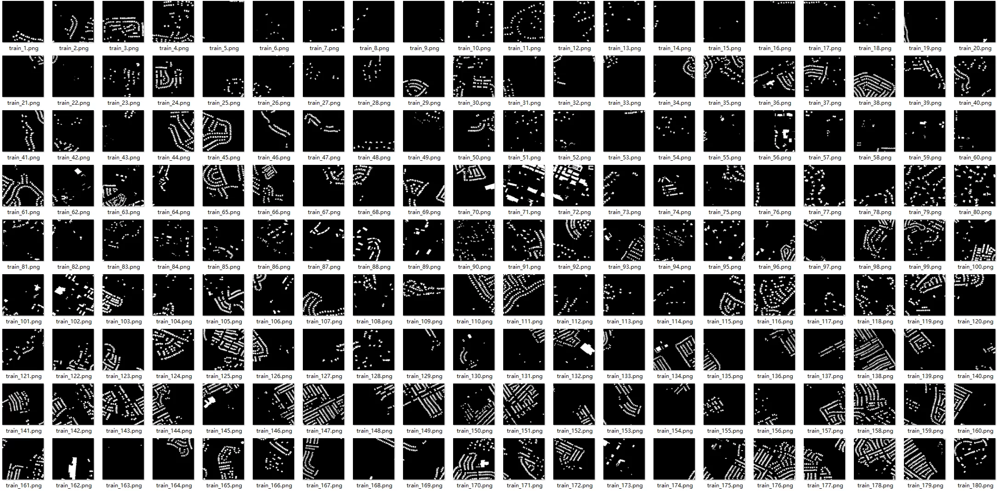
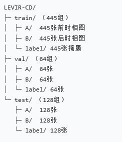
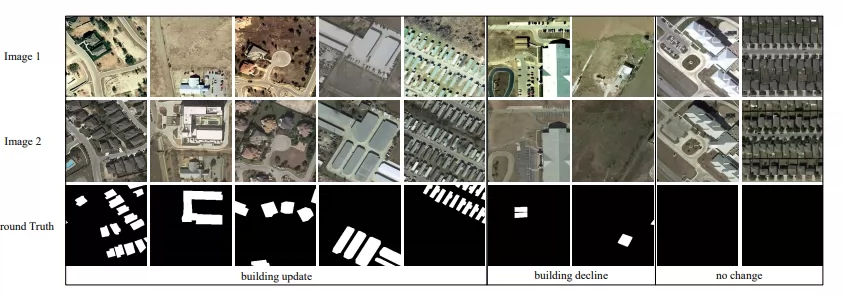
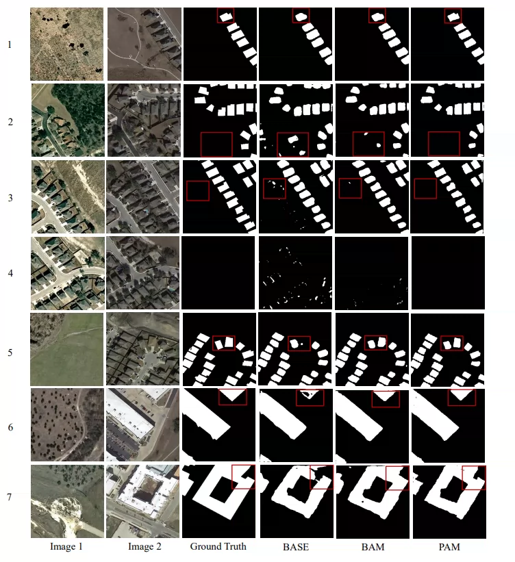
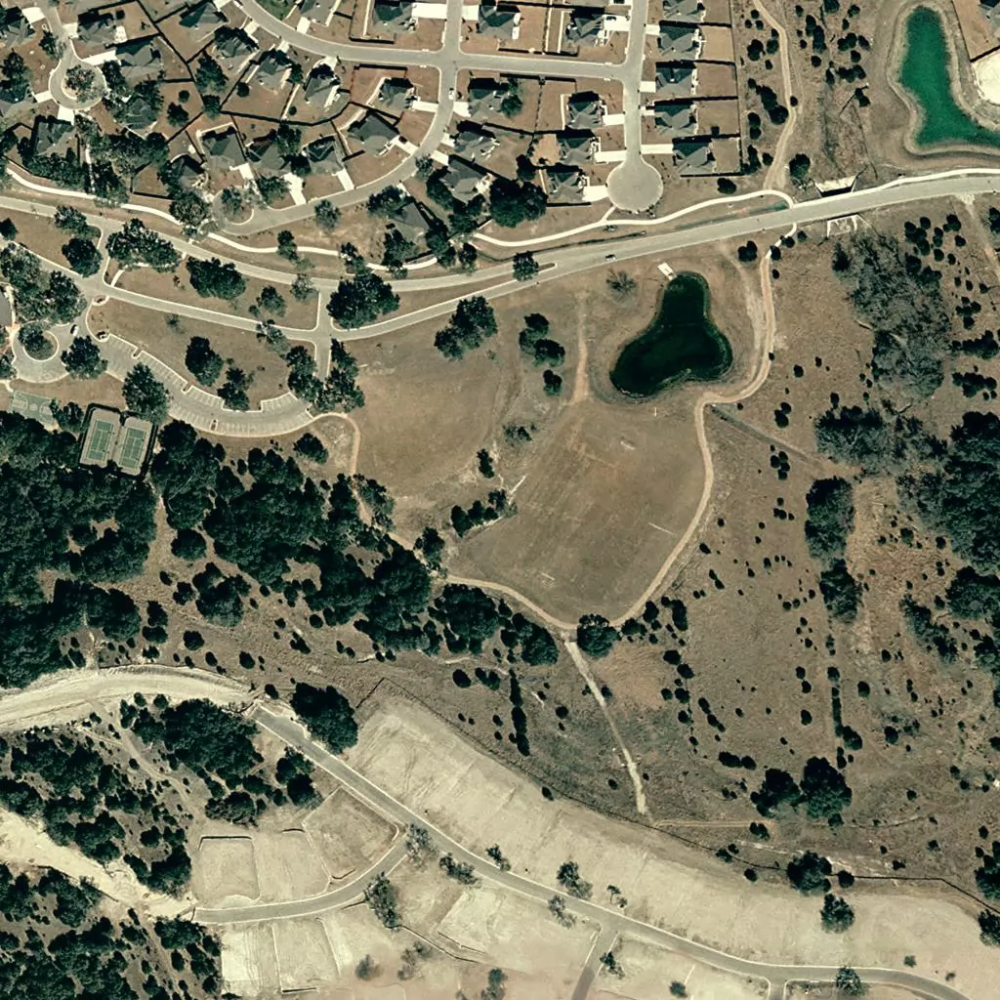
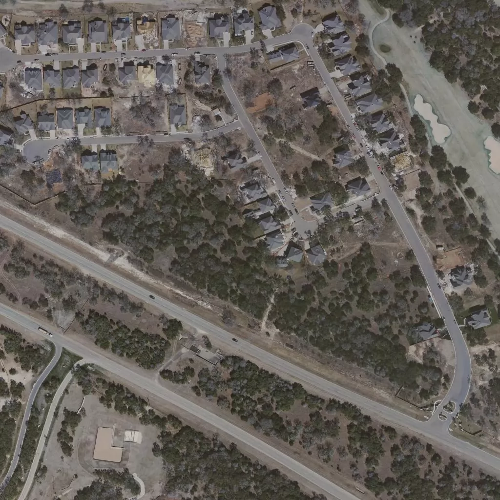

## Body

LEVIR-CD Building Change Detection Image Dataset

LEVIR-CD consists of 637 pairs of high-resolution (VHR, 0.5 meters per pixel) Google image patches, with a pixel size of 1024×1024 pixels.

These cross-temporal images span 5 to 14 years and reflect significant land use changes, particularly in the growth of buildings.

LEVIR-CD covers various types of buildings, such as villa residences, high-rise apartments, small garages, and large warehouses. Here, we focus on building-related changes, including the growth of buildings (from soil/grass/hardened ground or construction in progress to new areas), as well as the decline of buildings.

These dual-time-period images are annotated by remote sensing image analysts using binary labels (change = 1, no change = 0). Each sample in our dataset is annotated by one annotator, who then checks it again by another annotator to produce high-quality annotations. The fully annotated LEVIR-CD contains 31,333 independent change instances.

Author's source article included.

Electronic virtual products sold are non-refundable.

## Images

item_1062989245189

Here is a pay link on Stripe ( https://buy.stripe.com/3cs8yP7sY87d0vu9AB ). Please contact me lonlonago@foxmail.com after funding $89, and I will send you a complete data files , thank you!

